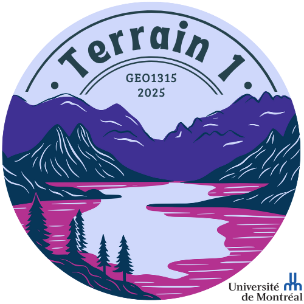

# Lisez-moi \| **Comment parcourir ce document**

L'objectif de ce document est de vous offrir une vue d'ensemble des données physiques collectées par chacune des équipes lors du cours Terrain 🤓

-   Vous trouverez dans les prochaines sections une panoplie de graphique faisant un sommaire des différents volets du cours.

-   La table de matière située dans le coin haut gauche, vous permet de circuler à travers les sections. 📖

-   Les graphiques sont interactifs, alors laissez circuler votre curseur 🐁 sur les images pour voir des informations additionnelles apparaître.

-   N'ayez pas peur de la programmation ! Cliquez sur l'onglet " 👈 voir le code ici" afin de consulter les lignes de codes R nécessaires à la création de chaque graphique. Ce type de rapport est aussi à votre porté.

# Tableau \| **Base de données commune**

Ce tableau contient les données recueillies par 7 équipes du groupe A et 6 du groupe B. Ensemble, nous avons échantillonné 11 lacs, pour un total de 109 observations.

Parmi ces lacs, nous avons 4 lacs protégés dans le secteur de la SBL (Lac Triton, Croche, Cromwell Geai) et 7 autres lacs anthropisés, hors de la SBL (HSBL).

Plusieurs variables liées à la chimie de l'eau, la communauté de zooplancton et les émissions de CO2 vers l'atmosphère, ont été mesurées.

```{r, message=FALSE, warning=FALSE}
#Importer les libraries necessaires
library(tidyverse) # librairie de visualisation de données
library(plotly) # permet de rendre les diagrammes interactifs
library(readxl) # permet d'ouvrir des fichier excel
library(DT) # produit des tableau interactifs


# Charger les données
#df <- read_xlsx("Base de données commune.xlsx")
data <- read_xlsx("Base de données commune.xlsx")

# Afficher le tableau interactif avec des lignes plus serrées
datatable(
  data,
  options = list(pageLength = 5),
  filter = "top",
  class = "compact stripe hover"  # Ajoute classe CSS pour compacter les lignes
) %>%
  formatStyle(
    columns = colnames(data),
    `font-size` = '12px',   # Réduit la taille du texte
    `line-height` = '1em'   # Réduit la hauteur de ligne
  )

```

# Carte **\| Où avons-nous échantillonné ?**

Grâce à cette carte, vous pouvez identifier vos sites d'échantillonnage et repérer ceux de vos collègues également 👀

Commençons par identifier qui étaient nos champions de l'échantillonnage. La médaille d'or🥇 pour le lac ayant été le plus souvent échantillonné est remporté par... 🥁

le Lac Triton 🏆 (18 échantillons), suivi du lac Croche🥈 (15 échantillons) et du lac Crowmell 🥉 (14 échantillons).

Bravo aux équipes A2, A5, B2, B5 pour ce travail collaboratif! 👏

```{r, message=FALSE, warning=FALSE}

library(leaflet) # Pour produire des cartes interactives
library(htmltools)

lake_counts <- data %>%
  group_by(LAC) %>%
  summarise(n_samples = n())

#print(lake_counts)


# Générer des couleurs (ajuster si n > 66)
couleurs <- ifelse(data$GROUPE=="A", "purple","orange")

# Afficher la carte
leaflet(data) %>%
  addTiles() %>%
  addCircleMarkers(
    lng = ~LONGITUDE,
    lat = ~LATITUDE,
    radius = 5,
    color = couleurs,
    label = ~htmlEscape(EQUIPE),
    stroke = FALSE,
    fillOpacity = 1
  ) %>%
  addLegend(
    "bottomright",
    colors = c("purple", "orange"),
    labels = c("A", "B"),
    title = "Groupes"
  )

```

# Diagramme de sucette \| **Conductivité de l’eau** 

L'un des constats les plus frappant de notre étude fut la différence marquée de conductivité électrique de l'eau entre les lacs de la SBL et ceux qui ce situent hors de la SBL.

La conductivité de l'eau est une mesure de la capacité de l'eau à conduire un courant électrique. Elle est dû à la présence des ions dissous dans l'eau. L'épandage du sel sur les routes en hiver, est une des cause principale de l'augmentation de la conductivité dans les zones hors de la SBL, surtout au moment de la fonte des neiges au printemps.

Selon le [CRE Laurentides](https://crelaurentides.org/wp-content/uploads/2021/10/fiche_conductivite.pdf), les eaux ayant une conductivité supérieure à 200 uS/cm sont considérées comme des eaux minérales et non de l'eau douce. Le dépassement de se seuil peut avoir des impacts sur les espèces aquatiques qui sont adaptées à des milieux d'eau douce. Le lac Rond dépasse se seuil, alors que les lacs Echo et Connelly s'en rapproche.

```{r, message=FALSE, warning=FALSE}


# Filtrer les données nécessaires
df_clean <- data %>%
  select(EQUIPE, LAC, SECTEUR, Conductivité) %>%
  filter(!is.na(Conductivité))

# Moyenne de la conductivité par ÉQUIPE et SECTEUR
df_summary <- df_clean %>%
  group_by(EQUIPE, SECTEUR,LAC) %>%
  summarise(Conductivité = mean(Conductivité, na.rm = TRUE)) %>%
  ungroup()

#df_summary
# Créer le graphique ggplot
sucette <- ggplot(df_summary, 
                  aes(
  x = Conductivité,
  y = reorder(EQUIPE, Conductivité),
  color = SECTEUR,
  text = paste0(
    "LAC : ", LAC, "<br>",
    "SECTEUR : ", SECTEUR, "<br>",
    "Conductivité : ", round(Conductivité, 2), " µS/cm"
  )
)) +
  geom_segment(aes(x = 0, xend = Conductivité, yend = EQUIPE), size = 1.2, color = "gray") +
  geom_point(size = 4) +
  #scale_color_manual(values=c("red", "blue"))+
  labs(
    title = "Conductivité éléctrique de l'eau moyenne des lacs d'étude",
    x = "Conductivité (µS/cm)",
    y = "Équipe"
  ) +
  theme_minimal() +
  theme(
    axis.text.y = element_text(size = 10),
    axis.title = element_text(size = 12, face = "bold")
  )

#sucette

# Rendre le graphique interactif
ggplotly(sucette, tooltip = "text")

```

# Nuage de points \| **Hydrographie des lacs**

La taille d'un bassin versant et de son plan d'eau sont généralement positivement relié. En effet, plus l’aire du lac plus le bassin versant qu'il occupe est petit lui aussi.

Mais leurs taille respective n'a pas nécessairement d'impact sur le temps de résidence de l'eau. Vous observerez que le lac croche de la SBL (petit lac de tête) et le lac de l'Achigan (le plus grand lac de la région) ont tous les deux un temps de résidence de l'eau similaire d'environ 1 an.

```{r, message=FALSE, warning=FALSE}

# Créer le graphique ggplot
nuage <- ggplot(data, aes(
  x = Aire_BV_km2,
  y = Aire_lac_km2,
  size=Temps_renouvellement_yr,
  color = SECTEUR,
  text = paste0(
    "Lac : ", LAC, "<br>",
    "Secteur : ", SECTEUR, "<br>",
    "Temps de renouvellement: ", round(Temps_renouvellement_yr, 2),"<br>",
    #"Aire du lac : ", round(Aire_lac_km2, 2), " km²<br>",
    "Ratio de drainage : ", round(Ratio_Drainage, 2)
  )
)) +
  geom_point(alpha = 0.8) +
  labs(
    title = "Hydrographie",
    x = "Aire du bassin versant (km²)",
    y = "Aire du lac (km²)",
    color = "Secteur",
    size= "Temps de renouvellement (années)"
  ) +
  
  scale_color_manual(values = c("HSBL" = "red", "SBL" = "blue")) +
  scale_y_log10()+
  scale_x_log10()+
  
  theme_minimal() +
  theme(
    plot.title = element_text(face = "bold", size = 14, hjust = 0.5),
    axis.title = element_text(size = 12),
    legend.title = element_text(face = "bold")
  )


# Convertir en graphique interactif
ggplotly(nuage, tooltip = "text") 

```

# Diagramme en barres \| **Statut trophique des lacs**

Le phénomène d'eutrophisation des lacs se caractérise par une vieillissement prématuré dû à un apport excessif en nutriment. Dans les Laurentides, les lacs sont typiquement oligotrophe (jeune), mais la présence humaine amène un apport supplémentaire en nutriment qui peu enrichir les lacs.

Malgré que des mesures importantes ont été mises en place au cours des dernières décénnies pour limiter l'apport de nutriment des lacs dans plusieurs régions du Québec (p.ex. par la réfection des fosses septiques, l’aménagement des bandes riveraines et l'interdiction d'épandage d'engrais etc.), l'eutrophisation demeure un enjeu a surveiller pour les lacs des Laurentides.

Les lacs Pin Rouge et Echo ont aujourd'hui un statut trophique de "mésotrophe", vous pouvez voir si bas les indices permettant d'établir ces qualifications. En effet, la concentration de chrolophylle de ces deux lacs dépasse le seuil oligo/mésotrophe.

Malgré que le lacs Rond ait d'importants enjeu d'apports en sel (comme démontré dans la section 4), son statut trophique demeure oligotrophe car les apports en nutriments sont plus limité que ceux en sel.

```{r, message=FALSE, warning=FALSE,fig.width=5, fig.height=8}


# Formater en numérique
data$phosphore_total=as.numeric(data$phosphore_total)
data$chlorophylle_a=as.numeric(data$chlorophylle_a)
data$carbone_organique_dissous=as.numeric(data$carbone_organique_dissous)

# Résumer : Moyenne par lac (pour avoir une seule barre par lac)
trophic_summary <- data %>%
  group_by(LAC) %>%
  summarise(
    phosphore_total = mean(phosphore_total, na.rm = TRUE),
    chlorophylle_a = mean(chlorophylle_a, na.rm = TRUE),
    carbone_organique_dissous = mean(carbone_organique_dissous, na.rm = TRUE)
  ) %>%
  ungroup()


# Phosphore total
plot_phosphore <- plot_ly(
  trophic_summary,
  x = ~LAC,
  y = ~phosphore_total,
  type = "bar",
  name = "Phosphore total",
  marker = list(color = "steelblue")
) %>%
  add_segments(x = "Achigan", xend = "Rond", 
               y = 10, yend = 10,
               line = list(color = "black", width = 1),
               showlegend = FALSE) %>%
  add_annotations(x = "Rond", y = 11,
                  text = "Seuil oligo/méso",
                  showarrow = FALSE,
                  font = list(color = "black", size = 12),
                  xanchor = "right") %>%
  layout(
    title = "Phosphore total par lac",
    xaxis = list(title = ""),
    yaxis = list(title = "Phosphore total (µg/L)"),
    showlegend = FALSE
  )


# Chlorophylle a
plot_chlorophylle <- plot_ly(
  trophic_summary,
  x = ~LAC,
  y = ~chlorophylle_a,
  type = "bar",
  name = "Chlorophylle a",
  marker = list(color = "forestgreen")
) %>%
    add_segments(x = "Achigan", xend = "Rond", 
               y = 3, yend = 3,
               line = list(color = "black", width = 1),
               showlegend = FALSE) %>%
  add_annotations(x = "Rond", y = 4,
                  text = "Seuil oligo/méso",
                  showarrow = FALSE,
                  font = list(color = "black", size = 12),
                  xanchor = "right") %>%
  layout(
    title = "Chlorophylle a par lac",
    xaxis = list(title = ""),
    yaxis = list(title = "Chlorophylle a (µg/L)"),
    showlegend = FALSE
  )

# Carbone organique dissous
plot_carbone <- plot_ly(
  trophic_summary,
  x = ~LAC,
  y = ~carbone_organique_dissous,
  type = "bar",
  name = "Carbone organique dissous",
  marker = list(color = "orange")
) %>%
  add_segments(x = "Achigan", xend = "Rond", 
               y =5, yend = 5,
               line = list(color = "black", width = 1),
               showlegend = FALSE) %>%
  add_annotations(x = "Rond", y = 6,
                  text = "Seuil oligo/méso",
                  showarrow = FALSE,
                  font = list(color = "black", size = 12),
                  xanchor = "right") %>%
  layout(
    title = "Carbone organique dissous par lac",
    xaxis = list(title = ""),
    yaxis = list(title = "Carbone organique dissous (mg/L)"),
    showlegend = FALSE
  )

# Affichage
fig_combiné <- subplot(plot_phosphore, plot_chlorophylle, plot_carbone,
                       nrows = 3, titleY = TRUE, titleX = TRUE
                      ) %>% 
  layout(title = 'Indice de statut trophique')
fig_combiné

```

# Heatmap \| **Biogéographie du** **Zooplancton**

Plongeons maintenant dans le monde microscopique mais fascinant du zooplancton 🔬. Nous nous sommes amusé a caractériser la communauté de zooplancton de chacun des lacs d'étude.

Vous verrez dans ce graphique quels espèces sont abondante et lesquelles sont plus rare. Les calanoides étaient présent dans tous les lacs d'étude, alors que les leptodora, ostracoda et polyphemus étaient rare.

```{r, message=FALSE, warning=FALSE}

# Sommariser la base de données (0/1)
presence_absence <- data %>%
  select(LAC, 42:54) %>%
  group_by(LAC) %>%
  summarise(across(everything(), ~max(.x, na.rm = TRUE)), .groups = 'drop') 


# Étape 2: convertir en format long
heatmap_data <- presence_absence %>%
  pivot_longer(cols = -LAC, 
               names_to = "Espèce", 
               values_to = "Présence") %>%
  mutate(
    # Convertir 0/1 enprésent/absent
    Presence_factor = factor(Présence, levels = c(0, 1), labels = c("Absent", "Présent"))
  )

# Étape 3: Créer le graphique
heatmap_plot <- ggplot(heatmap_data, aes(x = Espèce, y = LAC, fill = Presence_factor)) +
  geom_tile(color = "white", size = 0.5) +
  scale_fill_manual(
    values = c("Absent" = "#440154FF", "Présent" = "#FDE725FF"),
    name = "Status"
  ) +
  theme_minimal() +
  theme(
    # Rotate x-axis labels for better readability
    axis.text.x = element_text(angle = 45, hjust = 1, vjust = 1, size = 10),
    axis.text.y = element_text(size = 10),
    axis.title = element_text(size = 12, face = "bold"),
    legend.title = element_text(size = 11, face = "bold"),
    legend.text = element_text(size = 10),
    panel.grid = element_blank(),
    plot.title = element_text(size = 14, face = "bold", hjust = 0.5),
    plot.margin = margin(20, 20, 20, 20)
  ) +
  labs(
    title = "Distribution des zooplanctons a travers nos lacs d'étude",
    x = "Zooplancton",
    y = "Lac",
  )

ggplotly(heatmap_plot)
```

# Classement \| **Qui était le plus grand émetteur de CO~2~?**

Le lacs Pin rouge fut le lacs ayant les plus haut flux de CO~2~ envers l’atmosphère, alors que le lac Echo était le seul agissant comme un puit net de CO2 envers l'atmosphère. Tout les deux sont des lacs classé "mésotrophe" comme nous avons vu plus haut ce qui peut contribuer a augmenter l'écart des flux de CO~2~ (tant positivement que négativement).

Toutefois, quand vient le temps de déterminer quel lac fut le plus grand émetteur de CO~2~, c'est le lac de l'Achigan qui remporte haut la main 🏆. Lorsqu'on calcule les émissions totale d'un lac, c'est la taille qui fait toute la différence.

Vous constaterez également que le lac Geai (notre plus petit lac d'étude) avait des flux de CO~2~ d'une quantité non négligeable, mais sa petite taille rend ces émissions minimes. Cela ne veut toutefois pas dire que les petits lacs ne sont pas des sources importante de CO~2~ envers l'atmosphère, au contraire, il sont très important parce qu'ils sont nombreux! La force est dans la taille, mais aussi dans l'abondance 💪.

```{r, message=FALSE, warning=FALSE,fig.height=6}


# Sommariser les données
CO2_summary <- data %>%
  select(LAC, CO2_Flux_mgCm2d, CO2_Emission_TgCyr) %>%
  group_by(LAC) %>%
  summarise(
    CO2_Flux_mgCm2d = mean(CO2_Flux_mgCm2d, na.rm = TRUE),
    CO2_Emission_TgCyr = mean(CO2_Emission_TgCyr, na.rm = TRUE),
    n_observations = n(), # Count non-NA observations
    .groups = 'drop'
  ) 


# Create rankings
flux_ranking <- CO2_summary %>%
  arrange(desc(CO2_Flux_mgCm2d)) %>%
  mutate(flux_rank = row_number()) %>%
  select(LAC, CO2_Flux_mgCm2d, flux_rank, n_observations)


emissions_ranking <- CO2_summary %>%
  arrange(desc(CO2_Emission_TgCyr)) %>%
  mutate(emissions_rank = row_number()) %>%
  select(LAC, CO2_Emission_TgCyr, emissions_rank, n_observations)

# CO2 flux plot with tooltip
flux_plot <- ggplot(flux_ranking, aes(x = CO2_Flux_mgCm2d, y = LAC,
                                      text = paste("Lac:", LAC,
                                                   "<br>Flux CO2:", round(CO2_Flux_mgCm2d, 2), "mg C/m²/année",
                                                   "<br>Nombre d'observations:", n_observations))) +
  geom_col(fill = "steelblue") +
  labs(x = "Flux de CO2 (mg C / m2 / année)",
       y = "Lac") +
  theme_minimal()

# CO2 emissions plot with tooltip
emissions_plot <- ggplot(emissions_ranking, aes(x = CO2_Emission_TgCyr, y = LAC,
                                                text = paste("Lac:", LAC,
                                                             "<br>Émissions CO2:", round(CO2_Emission_TgCyr, 2), "Tg C/année",
                                                             "<br>Nombre d'observations:", n_observations))) +
  geom_col(fill = "coral") +
  labs(x = "Emissions de CO2 (Tg C / année)",
       y = NULL) +
  theme_minimal()

# Convert to plotly and combine
fig_combiné_CO2 <- subplot(
  ggplotly(flux_plot, tooltip = "text"), 
  ggplotly(emissions_plot, tooltip = "text"), 
  nrows = 1, titleY = TRUE, titleX = TRUE
) %>% 
  layout(title = 'Empreinte CO2 des lacs')

fig_combiné_CO2

```

# Mot de la fin

Merci de nous avoir lu et d'avoir participé au cours.

Nous vous souhaitons une bonne continuité dans vos études.

Au plaisir de vous croiser sur le campus!

-Votre équipe terrain (Audrey, Ornella, Félix, Marie-Pierre, Élodie, Léa et Sarah)

{fig-align="center" width="400"}

*Ce travail de programmation a été réalisé par François Kabambi, étudiant à la maîtrise au programme environnement et développement durable de l'université de Montréal, sous la supervision de Audrey Campeau.*
